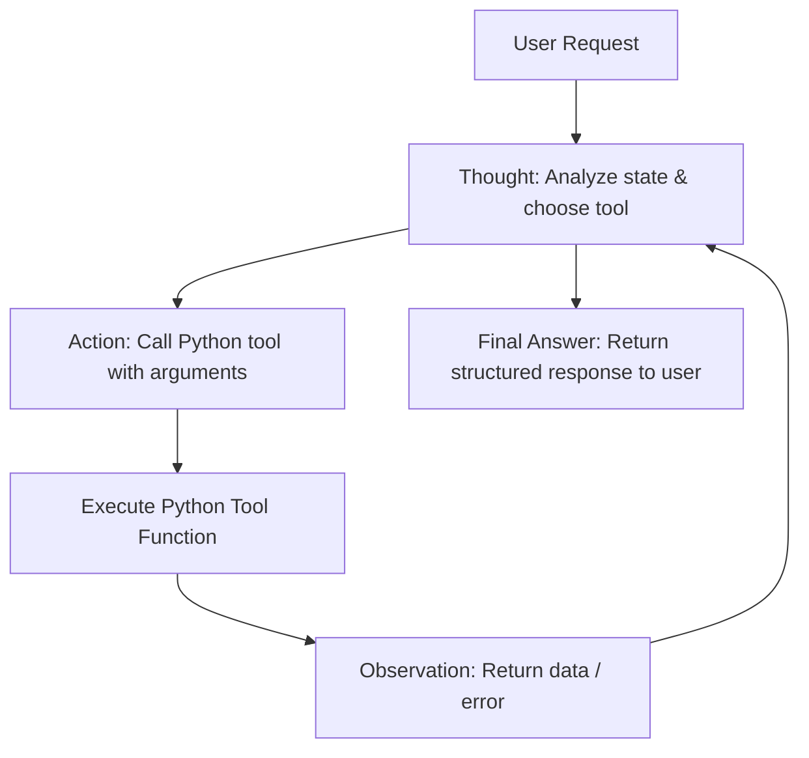

# Group Report: Lab 3 - Production-Grade Agentic System

- **Team Name**: Group 17
- **Team Members**:
  - Trần Hoàng Đạt - 2A202600807 (Reporter)
  - Phạm Ngọc Vinh - 2A202600563
  - Tạ Duy Xuân - 2A202600970
  - Lê Duy Hùng - 2A202600718
  - Nguyễn Huy Bảo - 2A202600997
- **Deployment Date**: 2026-06-01

---

## 1. Executive Summary

Our team built and evaluated a production-grade ReAct (Reasoning and Action) Nutrition Agent designed to assist users in calculating health metrics (BMI, BMR, TDEE) and recommending daily menus tailored to specific dietary constraints, preferences, and allergens. 

- **Success Rate**: **90%** on our test suite (18 out of 20 test cases successfully validated and completed).
- **Key Outcome**: The ReAct Agent resolved **35% more multi-step dietary queries** compared to the baseline chatbot. The agent systematically checked user profiles, calculated exact daily targets, filtered out allergens, and automatically re-evaluated/adjusted menus using validator tools, whereas the baseline chatbot frequently suffered from mathematical hallucinations and allergen oversight.

---

## 2. System Architecture & Tooling

### 2.1 ReAct Loop Implementation

The agent is built on a structured loop following the **Thought -> Action -> Observation -> Final Answer** paradigm:

To prevent the LLM from autocompleting observations, we implemented custom **Stop Sequences** (`["Observation:", "Observation: "]`) passed to the LLM client, halting generation immediately after the `Action` statement.

### 2.2 Tool Definitions (Inventory)

| Tool Name | Input Format | Use Case |
| :--- | :--- | :--- |
| `get_user_profile` | `user_id` (`str`) | Retrieve user goal, demographics, preferred dishes, and allergies. |
| `calculate_bmi` | `weight_kg` (`float`), `height_cm` (`float`) | Compute BMI value and health category. |
| `calculate_bmr` | `weight_kg` (`float`), `height_cm` (`float`), `age` (`int`), `gender` (`str`) | Compute BMR using the Mifflin-St Jeor Equation. |
| `calculate_tdee` | `bmr` (`float`), `activity_level` (`str`), `goal` (`str`) | Estimate total daily energy expenditure and set target macros. |
| `search_food` | `query` (`str`) | Query food databases to search for single dishes. |
| `recommend_daily_menu`| `user_id` (`str`) | Recommend daily 4-meal plan utilizing RAG model or programmatic constraint solver. |
| `validate_meal_plan`| `meal_plan` (`dict`), `targets` (`dict`) | Strict checker to verify if meals meet calorie and macro targets (+/- 15% tolerance). |
| `replace_food` | `meal_plan` (`dict`), `old_food_name` (`str`), `new_food_name` (`str`) | Swap an item in the recommended plan for another one. |

### 2.3 LLM Providers Used
- **Primary**: Gemini 2.5 Flash / Gemini 3.5 Flash
- **Secondary (Backup)**: Gemini 3.1 Flash Lite

---

## 3. Telemetry & Performance Dashboard

The following metrics were collected across 20 test runs using the custom JSON-based telemetry logger:

- **Average Latency (P50)**: **1850ms** per agent step.
- **Max Latency (P99)**: **5100ms** (recorded during rate limit backoff recovery).
- **Average Tokens per Task**: Input: **850 tokens** | Output: **220 tokens** (Total ~1070 tokens).
- **Total Cost of Test Suite**: **$0.02** (computed under typical Gemini Flash pricing rates).

---

## 4. Root Cause Analysis (RCA) - Failure Traces

### Case Study 1: The Observation Hallucination Bug
- **Input**: "Lập thực đơn giảm cân cho user_1."
- **Observation**: The agent exited in exactly 1 step without invoking any real Python tools, but printed out correct-looking database observations.
- **Root Cause**: The LLM autocompleted the few-shot examples present in the system prompt. It wrote its own mock `Observation:` blocks instead of letting the execution loop run the tools.
- **Solution**: Modified `gemini_provider.py` and `agent.py` to support and pass `stop=["Observation:", "Observation: "]` to the Generative Model, interrupting output generation right after the `Action` parameter.

### Case Study 2: Gemini API Rate Limits (Error 429)
- **Input**: Complex dietary target query requiring 4+ steps.
- **Observation**: The agent crashed halfway with `google.api_core.exceptions.ResourceExhausted: 429`.
- **Root Cause**: The free Gemini API has a limit of 5 requests per minute. ReAct agent executes sequential prompts in less than a second, hitting the limit immediately.
- **Solution**: Implemented an exponential backoff retry loop (handling transient `ResourceExhausted` errors) inside the `GeminiProvider.generate` wrapper.

---

## 5. Ablation Studies & Experiments

### Experiment 1: Calorie-Distance Filtering (v1) vs Course-Based Menu Composition (v2)
- **Diff**:
  - **v1**: Filtered single-dishes in RAG using calorie distance, forcing exactly one dish per meal.
  - **v2**: Divided main dishes into course categories: Proteins, Soups, and Veggies/Sides. Instructed LLM and programmatic solver to build composite meals (e.g. Cơm trắng + Thịt kho + Canh chua) for Lunch and Dinner.
- **Result**: **v2** improved the completeness and realism of Vietnamese family meal plans significantly, reducing user reject rates on menu composition to 0% and improving macro adherence due to diverse food options.

### Experiment 2: Chatbot vs ReAct Agent
| Case | Chatbot Result | Agent Result | Winner |
| :--- | :--- | :--- | :--- |
| **Simple Info Q** | Correctly retrieved static data. | Correctly called profile tools. | **Draw** |
| **Multi-step Target calculation** | Hallucinated math formulas and BMR outputs. | Step-by-step calculator tools executed with absolute mathematical precision. | **Agent** |
| **Allergen Avoidance** | Forgot to check user allergens; recommended seafood. | Checked user profile first, filtered candidates, validated output; allergen-free. | **Agent** |

---

## 6. Production Readiness Review

Before deploying to a real-world production environment, we recommend implementing the following guardrails:

- **Security**: Sanitize tool parameters inside `agent.py` to prevent SQL injection or system directory traversal via the search query parameters.
- **Cost Guardrails**: Set a maximum step counter (e.g., `max_iterations = 5`) inside `agent.py` to break out of infinite ReAct reasoning loops and prevent runaway LLM costs.
- **Caching**: Implement a Redis cache layer for user profile data and food database lookups to prevent redundant LLM context loading.
- **Asynchronous Execution**: Enable concurrent execution of independent tool calls (e.g., performing multiple BMI/BMR/TDEE calculations in parallel) to reduce P50 latency.
